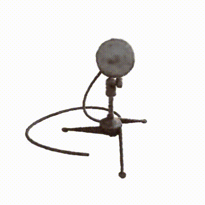

# Play-NeRF

## NeRF

**Learn from:** [keras-io/nerf](https://keras.io/examples/vision/nerf/)

 

## Instant-NGP

**Learn from:** [HashNeRF-pytorch](https://github.com/yashbhalgat/HashNeRF-pytorch)

|  |  |  |  |
| --- | --- | --- | --- |
|  |  |  |  |

## Citation

```
@misc{bhalgat2022hashnerfpytorch,
  title={HashNeRF-pytorch},
  author={Yash Bhalgat},
  publisher = {GitHub},
  journal = {GitHub repository},
  howpublished={\url{https://github.com/yashbhalgat/HashNeRF-pytorch/}},
  year={2022}
}
```
